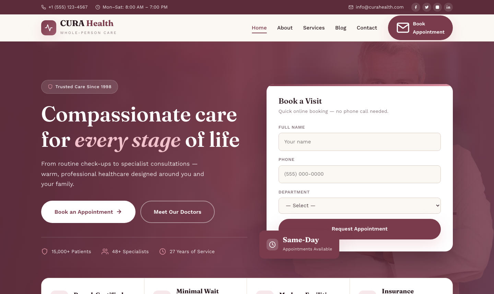

# CURA Health — Medical Clinic & Healthcare Template

**Whole-person care, close to home.**

A premium, framework-free medical clinic website template built with semantic HTML5, custom CSS design system, and vanilla JavaScript. Designed for clinics, healthcare providers, and wellness centres that want a warm, professional online presence.

## 📸 Screenshot

## Design System

| Token | Value |
|-------|-------|
| **Primary** | `--clr-wine` `#7a3b4d`, `--clr-wine-soft` `#9e5a6e` |
| **Accent** | `--clr-rose` `#d98e9e`, `--clr-rose-lite` `#f6e8eb` |
| **Ground** | `--clr-cream` `#fbf8f4`, `--clr-card` `#ffffff` |
| **Text** | `--clr-ink` `#2b1a20`, `--clr-text` `#4e3d44`, `--clr-muted` `#8b7a81` |
| **Display type** | `Fraunces` (400–700, incl. italics) |
| **Body type** | `Work Sans` (400–700) |
| **Container** | 1200px max-width, centered |
| **Radius** | 14px / 22px |
| **Breakpoints** | ~992px, ~768px, ~576px |

## Pages

| Page | File | Description |
|------|------|-------------|
| Home | [index.html](index.html) | Wine hero with booking card, feature ribbon, 6 department cards, about split, 3 doctor profiles, 3 testimonials, CTA |
| About | [about.html](about.html) | Clinic story since 1998, mini stats, 3 value cards, full doctor team grid |
| Services | [services.html](services.html) | 6 department cards with detailed descriptions, 3-step care process |
| Blog | [blog.html](blog.html) | 3 article cards with tags, author, date, and read links |
| Contact | [contact.html](contact.html) | 4 info cards, embedded map, appointment/contact form with validation |
| 404 | [404.html](404.html) | On-brand error page with gradient 404 art and recovery links |

## Features

- **Framework-free** — pure HTML5, CSS3 (custom properties, Grid, Flexbox, `clamp()`), vanilla JavaScript
- **Warm medical aesthetic** — deep wine + rose + cream palette, Fraunces display headlines
- **Fluid responsive** — three breakpoints, no horizontal scroll on any viewport
- **Scroll reveal** — IntersectionObserver-powered `.reveal` animations (respects `prefers-reduced-motion`)
- **Mobile nav** — burger toggle with `aria-expanded` accessible pattern
- **Topbar** — phone, hours, email, social links
- **Hero** — split layout: clinic copy + same-day booking form card
- **Feature ribbon** — 4-point trust badges (board-certified, minimal wait, modern facilities, insurance welcome)
- **Department cards** — 6 services with icons, hover effects, and learn-more links
- **About split** — image with floating years badge, check-list, mini stats counters
- **Doctor profiles** — 3 team cards with photo, specialty, bio, social links
- **Testimonial cards** — patient quotes with avatar, name, and star ratings
- **CTA section** — conversion-focused callout with phone number and dual buttons
- **Contact form** — validation feedback, `[data-form]` hook, success/error states
- **Original imagery** — clinic photography, no placeholders

## Tech Stack

- HTML5 + CSS3 (W3C-valid, semantic landmarks)
- Vanilla JavaScript (canonical IIFE build)
- Google Fonts (Fraunces + Work Sans)
- SVG favicon (inline data: URI)
- OpenStreetMap embed (contact page)

## SEO

- Semantic HTML5 structure (`<header>`, `<nav>`, `<main>`, `<section>`, `<footer>`)
- Unique `<title>` and `<meta description>` per page
- `lang="en"` attribute, `charset="utf-8"`, viewport meta
- Alt text on all images

## License

Free for personal and commercial use. Attribution appreciated but not required.

---

## Let's Build Something Together 🚀

[Book a free consultation](https://tally.so/r/q4q1L9)